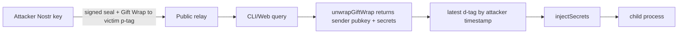
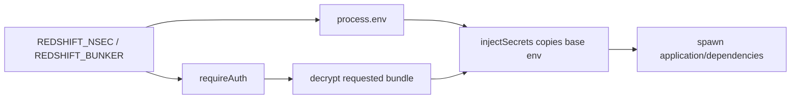
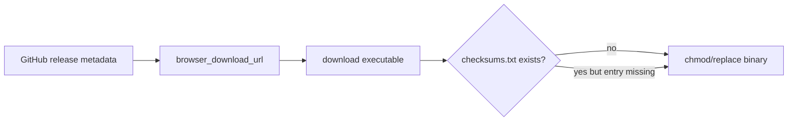

# Redshift Security & Product Knowledge Base

**Snapshot:** `main@9b98467`  
**Audit date:** 2026-07-09  
**Scope:** `README.md`, CLI, shared crypto/rate-limiter packages, SvelteKit web app, managed relay, installer/updater, GitHub Actions, documentation/specs, and automated/interactive tests. Vendored `.applesauce-src`, historical `.worktrees`, generated bundles, dependencies, and audit artifacts were excluded from source findings except where a generated artifact is itself deployed.

## Advisory Intelligence

- `bun audit` reported **38 root/web advisories** (1 critical, 14 high, 18 moderate, 5 low) and **15 relay advisories** (5 high, 7 moderate, 3 low).
- `yaml@2.8.2` is directly reachable through `redshift.yaml` parsing and is affected by GHSA-48c2-rrv3-qjmp (deeply nested collection stack overflow); upgrade to `>=2.8.3`.
- The critical Vitest UI advisory affects a listening `vitest --ui` server. CI runs `vitest run`; production reachability was not established.
- Most Vite, Rollup, PostCSS, Picomatch, and development-server advisories are build/dev/CI concerns. They still require upgrades, but they were not promoted as production vulnerabilities without a reachable path.
- Current release `v0.10.0` publishes four mutable binary assets with no checksum, signature, attestation, provenance, or SBOM. The release itself is not immutable.

## Component Inventory

See [`sbom.json`](./sbom.json). Security-critical components are Nostr signing/encryption (`nostr-tools`, `@redshift/crypto`), keychain/config storage, browser WebCrypto/IndexedDB storage, relay pools, Cloudflare Worker/Durable Object/D1, GitHub release distribution, installer/updater, and the remote `nostr-login@latest` script.

## Architecture and System Model

### Components

1. **CLI (`cli/src`)** — parses commands; loads auth/project config; queries/publishes Gift Wraps; injects decrypted values into child environments; serves an embedded static Svelte app; self-upgrades.
2. **Shared crypto (`packages/crypto`)** — NIP-44/NIP-59 wrap/unwrap, d-tag helpers, event validation.
3. **Web (`web/src`)** — SvelteKit static/Cloudflare app; NIP-07, nsec, and NIP-46 auth; EventStore-based project and secret editors.
4. **Managed relay (`relay/nosflare`)** — Cloudflare Worker + Durable Objects + D1; WebSocket Nostr protocol, NIP-42, payment checks, filtering, storage, and landing/payment UI.
5. **Distribution (`web/static/install`, `upgrade.ts`, Actions)** — GitHub API/releases, install script, self-replacement, release workflow.

### Assets

- User nsec / bunker client credential and signer authority.
- Plaintext application secrets after local decryption.
- Integrity and freshness of each `{project}|{environment}` bundle.
- Project metadata and encrypted event traffic metadata.
- Release binary integrity.
- Managed relay availability and paid-access boundary.

### Trust Boundaries

- Public Nostr sender/relay → client Gift Wrap decryptor/selector.
- CLI authentication environment/config/keychain → launched application process.
- Browser origin/sessionStorage/IndexedDB → NIP-07/local key/bunker signer.
- GitHub release API/assets → installed executable.
- unpkg CDN/package publisher → relay signing/payment origin.
- WebSocket client → managed relay NIP-42/payment/storage.
- Hostile repository files (`redshift.yaml`, `.env`) → local CLI parser.

### Attacker Capabilities

- Knows public Nostr keys and can publish valid attacker-authored Gift Wraps to public relays.
- Can control a repository's `redshift.yaml` or `.env` presented to a developer.
- Can authenticate a Nostr key to the public managed relay without necessarily having paid.
- Can open many relay connections or send signer-addressed NIP-46 events.
- Supply-chain attacker may compromise a release asset, workflow action ref, CDN package, or publishing account.
- Same-host observer may read process arguments and CI/terminal logs.

## High-Risk DFD Slices

## Phase 4 CodeQL Extraction Targets

| Slice | Source model | Sink |
|---|---|---|
| Gift Wrap poisoning | Remote WebSocket/Nostr event content, custom unwrap result | Environment mutation + `child_process.spawn` |
| Auth credential inheritance | Environment variable | Child process environment |
| Upgrade integrity | Remote GitHub JSON/asset | File write + executable replacement |
| Relay NIP-05 | Remote event metadata | HTTP request (currently disabled by config) |
| CLI config | Local file / CLI arguments | YAML parse, file access, command execution |

## CodeQL Structural Analysis

- CodeQL CLI `2.25.6`, JavaScript queries `2.4.0`.
- Database quality: **24,349 JavaScript LoC, 121 files, 0 extractor diagnostic records, finalized**. Svelte component script blocks are not comprehensively represented by the JavaScript extractor; web-specific review and browser tests supplement it.
- Run-all security-and-quality suite, threat model `all`: **58 findings**, including 54 security-tagged alerts before enrichment.
- The GitHub Security Lab JavaScript community pack could not be installed (GHCR returned 403); this limitation is documented in `codeql-artifacts/rulesets.txt`.
- Important candidates: command-line injection at `run.ts:138`, request-forgery paths in `upgrade.ts`/relay NIP-05, path injection, remote property writes, URL substring sanitization, and log injection. Most were downgraded after trust-boundary analysis; see SAST Enrichment.

## Static Analysis Summary

### Semgrep

- Semgrep `1.168.0`; Pro unavailable because the CLI was not authenticated, so the user-approved OSS fallback was used. Every invocation used `--metrics=off`.
- Official packs: `p/security-audit`, `p/secrets`, `p/owasp-top-ten`, `p/cwe-top-25`, `p/insecure-transport`, `p/javascript`, `p/typescript`, `p/nodejs`, `p/github-actions`. `p/yaml` was unavailable (registry 404).
- Required third-party packs: Trail of Bits (`31390b3`), elttam (`27c8bd2`), and Apiiro (`a21246b`). One Apiiro rule was incompatible with the installed parser and excluded; the remaining rules ran successfully.
- Official/third-party output: 9 mutable GitHub Action refs and one documentation-only unencrypted Redis example. No additional production code vulnerability survived enrichment.
- Architecture-specific rules were created in `piolium/semgrep-rules/redshift-security.yml` for Gift Wrap author authorization, auth credential inheritance, optional checksums, and mutable auth scripts. They matched the confirmed paths.

### GitHub Actions

- No AI agent action is present, so agentic prompt-injection vectors do not apply.
- Actions and Bun are mutable (`@vN`, `bun-version: latest`), installs are not frozen, and release permissions are workflow-wide.
- CI does not run TypeScript checking, Biome, dependency audit, browser E2E, or a real compiled-binary test.

## SAST Enrichment

| Candidate | Verdict | Reason |
|---|---|---|
| `run.ts` command-line injection | Correctness/UX, not security | The invoking local user intentionally chooses the command; Unix uses `shell:false`. Windows shell resolution remains a local-user footgun. The actual argv re-tokenization bug is confirmed separately. |
| Upgrade request forgery | Mostly false positive | URLs originate from GitHub release metadata, not an ordinary remote user. Artifact-integrity fail-open remains a valid supply-chain issue. |
| Relay NIP-05 SSRF | Not currently reachable | `checkValidNip05=false`; enablement would require domain allowlisting and SSRF controls. |
| `relays.includes(MANAGED_RELAY)` URL sanitization | False positive | Array `includes` tests exact string equality, not substring URL validation. |
| Secret object property writes | Security only when combined with unauthorized author | Prototype-pollution keys are rejected, but environment/runtime hook names remain dangerous. |
| YAML advisory | Correctness/availability | Hostile local project config can crash the CLI; no cross-user privilege gain shown. |
| Mutable Actions tags | Supply-chain hardening | Valid and actionable, but separate from a demonstrated current compromise. |

## Domain Attack Research

- NIP-59 explicitly states that the seal identifies the sender and the Gift Wrap may present a different outer author. Therefore successful decryption is not authorization; Redshift must check the seal/rumor author against the authenticated owner for self-authored secret state.
- NIP-01 defines `event.id` as the SHA-256 of serialized event data and the signature over that same hash. The managed relay verifies the signature over recomputed content but does not require the supplied `id` to equal the hash.
- NIP-42 permits a relay to authenticate one payer and accept events authored by other keys. Redshift's relay instead requires the event author to be authenticated/paid, which conflicts with ephemeral Gift Wrap authors.
- NIP-09 deletion requests apply to referenced events with the **same pubkey** as the deletion request. User-signed kind-5 requests cannot delete Gift Wraps authored by discarded ephemeral keys. Redshift must describe old ciphertext retention truthfully and rely on logical tombstones/key-rotation/retention design rather than claiming NIP-09 erasure.

## Spec Gap Analysis

1. **Owner authorization is missing** despite self-to-self secret storage semantics. NIP-59 authentication alone does not establish that the bundle is the user's own state.
2. **Deletion claims exceed protocol guarantees.** Project/environment deletion does not tombstone every affected secret d-tag, and user-signed NIP-09 cannot erase ephemeral-authored wrappers.
3. **Doppler compatibility is mostly help/parser-shaped.** Many accepted flags are ignored, unknown input fails open, and core `run` argv behavior is broken.
4. **Managed relay authorization conflicts with Gift Wrap authorship.** Standard clients discard ephemeral keys and cannot NIP-42 authenticate/pay as the outer author.
5. **Roadmap/spec truth is stale.** `/tutorial` is absent, Teams/Cloud are unimplemented proposals, and pricing/key-custody descriptions conflict.

## Phase 10 Addendum

Manual review and execution discovered additional high-risk paths not surfaced cleanly by generic SAST:

- A real local-relay PoC proved an attacker-authored bundle is accepted and wins latest-state selection. A harmless Node test proved attacker-selected `NODE_OPTIONS --import` executes code in a launched Node child.
- A compiled CLI local-relay journey proved `REDSHIFT_NSEC` reaches the child, spaced argv is split, `--command` fails, setup overwrites existing config, and config reads disclose fallback credentials.
- Browser testing proved the normal built web preview hydrates and local-nsec login/logout works, but `redshift serve` serves a blank admin because its CSP disallows the inline SvelteKit bootstrap. HTTP-only binary tests miss this.
- Running the documented local-relay integration test produced **8 pass / 2 fail**: the shared test key is zeroized through `SecretManager.disconnect()`, revealing an ownership/aliasing footgun and a suite that does not pass in its intended mode.
